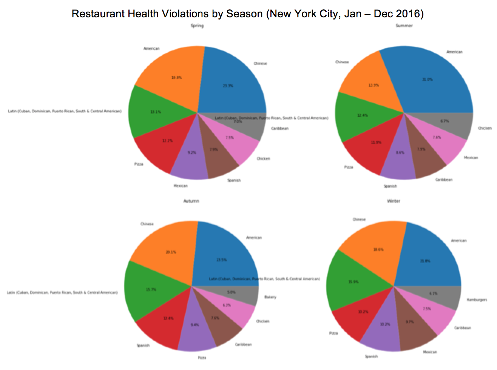

Health violations in New York City by season

This figure represents violations of the New York City restaurant sanitation codes by season. Conclusion: Chinese food is much safer in summer time than in spring or winter. And be careful of American restaurants in summer time, as their violations jump right up!
